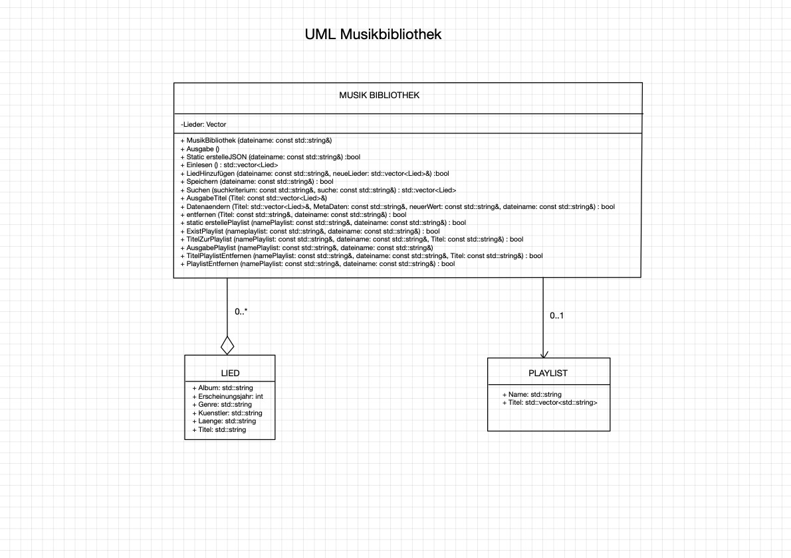

# Software-Technik Projekt "Musikbibliothek"

## Einleitung

Dieses semesterbegleitendes Projekt soll eine Musik-Bibliothek erstellen, welche von einem Online-Player genutzt werden kann.

## Funktion

Das Programm frägt den Benutzer zuerst ob eine bestehende Musikbibliothek geladen und initialisiert werden soll oder ob er eine neue Bibliothek erstellen soll. Danach erhält man ein Menü mit verschiedenen Möglichkeiten die Bibliothek zu aktualisieren.

## Meta-Daten

Es werden folgende Daten der Lieder gespeichert:

- Titel
- Künstler
- Album
- Erscheinungsjahr
- Genre
- Länge

## UML-Diagramm

